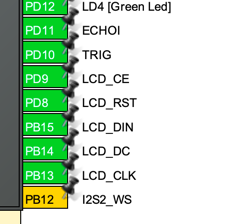

# Lab 6. Ultrasonic Distance Sensor - HC-SR04

> Team members: Andrii Yaroshevych, Pavlo Kryven
>
> Board: STM32F411E-DISCO

## Prerequisites

### Hardware

- [Discovery Kit with STM32F411VE MCU](https://www.st.com/en/evaluation-tools/32f411ediscovery.html)
- [HC-SR04 Ultrasonic Distance Sensor](https://www.google.com/search?q=ultrasonic+distance+sensor+hc-sr04)
- [Nokia 5110 LCD](https://www.google.com/search?q=nokia+5110+lcd)

### Software

- [STM32CubeIDE](https://www.st.com/en/development-tools/stm32cubeide.html) version 1.11.0 is highly recommended
> **Note**
>
> You can use any other IDE, but you will need to configure it manually.

## Compilation and Flashing

To compile the project in case of using other IDE, you will need to use the GNU Arm Embedded Toolchain. You can download it from [here](https://developer.arm.com/tools-and-software/open-source-software/developer-tools/gnu-toolchain/gnu-rm/downloads)

If you are using STM32CubeIDE, you can use the following steps to compile and flash the project after opening it:

1. Select the project in the Project Explorer
2. Right-click on the project and select `Build Project`
3. Right-click on the project and select `Run As` -> `1 STM32 C/C++ Application`

## Installation

Clone the repository to your local machine using the following command:

```bash
$ mkdir ~/workspace
$ cd ~/workspace
$ git clone https://github.com/ucu-cs/stm32_6-1-kryven_yaroshevych_
```

and open the project in STM32CubeIDE.

## Usage

Connect the Discovery Kit to your PC using the USB cable and flash the project to the board as described in paragraph [Compilation and Flashing](#compilation-and-flashing)

> **Note**
>
> You can change the measurement unit by pressing the `User` button on the board.

After flashing the project, the LCD will display the distance to the nearest object in centimeters.

### Demonstration

// TODO: add gif

## Additional tasks

- [x] Implement a device using interrupts and timers, so that the code does not use busy loops.

This was achieved by using timer and finite state machine. A diagram of the state machine is shown below:


## Configuration

The project was configured using STM32CubeMX. The configuration file can be found in the root directory of the project - `wall-e.ioc`.

Steps to configure the project:

1. Open STM32CubeMX
2. Open the `.ioc` configuration file
3. For the pins shown in the screenshots below, set the user labels:




4. Select the following modes for the pins:
- `PD11` - `GPIO_EXTI11`
- `PD10` - `GPIO_Output`
- `PD9` - `GPIO_Output`
- `PD8` - `GPIO_Output`
- `PB15` - `SPI2_MOSI`
- `PB14` - `GPIO_Output`
- `PB13` - `SPI2_SCK`
- `PA0` - `GPIO_EXTI0`

5. Go to the `Multimedia` tab and disable `I2S2` and `I2S3`.


6. Go to the `Connectivity` tab and enable `SPI2` to be used as `Transmit only master`.


In the `Parameter Settings` window, set the following parameters:
- `Prescaler` - `8`


7. Go to the `Timers` tab and enable `TIM10` with the following parameters:
- `Prescaler` - `96-1`
- `Counter Period` - `1000`


8. After that, go to the `System Core` tab -> `NVIC` and enable the following interrupts:

- `TIM1 update interrupt and TIM10 global interrupt`
- `EXTI Line[15:10] interrupts`
- `EXTI line0 interrupt`


9. In `GPIO` section select `PD11` pin and change the GPIO mode to `External Interrupt with Rising/Falling edge trigger detection`.


10. Go to `RCC` section:


Set both `HSE` and `LSE` to `Crystal/Ceramic Resonator`.

Finally, generate the code and open the project in STM32CubeIDE.

## Schematics
The schematics of the project is shown below:


For better quality, please feel free to open the [pdf version](./schematics/schematic_wall-e.pdf) of the schematics.

> To see the required hardware, please head to the [Prerequisites](#prerequisites) section.

## License
The [MIT](https://choosealicense.com/licenses/mit/) License (MIT)

Copyright © 2022. Andrii Yaroshevych, Pavlo Kryven